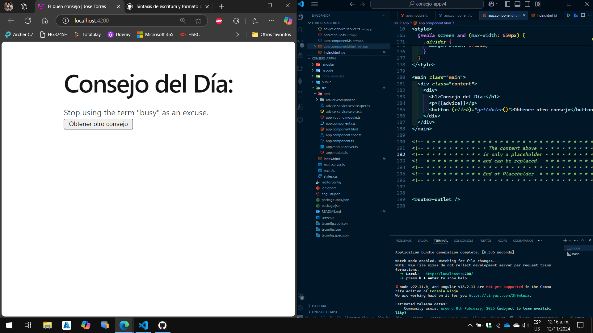

# El consejo del Dia
Esta app desarrollada en angular consume una API [Advice Slip](https://api.adviceslip.com, el cual tiene una estrucra de un titulo, el consejo y un boton para generar el texto.


Para tener exito en el desarrollo de esta app, se hizo lo siguiente:
## Crear el proyecto
```
ng new <nombre_proyecto> --standalone=false
```
Creamos el componente **AdviceComponent**:
```
ng generate component advice
```
Luego, creamos el servicio **AdviceService**:
```
ng generate service advice
```
## Configuramos el servicio HTTP
Vamos al archivo **advice.service.ts** y lo configuramos para consumir la API.
```
import { Injectable } from '@angular/core';
//importamos los modulos
import { HttpClient } from '@angular/common/http';
import { Observable } from 'rxjs';

@Injectable({
  providedIn: 'root'
})
export class AdviceServiceService {
  private apiUrl='http://api.adviceslip.com/advice';
  constructor(private http:HttpClient) { }
  getAdvice():Observable<any>{
    return this.http.get<any>(this.apiUrl);  //Obtenemos la sugerencia de consejos de la API
  }
}


```
Con esto configuramos el servicio para realizar una solicitud **GET**.

## Importamos el modulo HTTP
Hay que asegurarnos de importar el modulo **HttpClientModule** en el archivo **app.module.ts**, esto es para que Angular pueda realizar solicitudes HTTP.
```
import { NgModule } from '@angular/core';
import { BrowserModule, provideClientHydration } from '@angular/platform-browser';

import { AppRoutingModule } from './app-routing.module';
import { AppComponent } from './app.component';
import { AdviceComponentComponent } from './advice-component/advice-component.component';

//importamos el modulo http
import { HttpClientModule } from '@angular/common/http';
@NgModule({
  declarations: [
    AppComponent,
    AdviceComponentComponent
  ],
  imports: [
    BrowserModule,
    AppRoutingModule,
    HttpClientModule //importamos el modulo http
  ],
  providers: [
    provideClientHydration()
  ],
  bootstrap: [AppComponent]
})
export class AppModule { }


```
## Consumir el Servicio en el Componente
Ahora que ya tenemos todo configurado, podemos utilizar el componente para obtener datos de la API. Vamos al archivo del componente el cual es **app.component.ts** e inyectamos **AdviceServices** en el contructor:
```
import { Component, OnInit } from '@angular/core';
import { AdviceServiceService } from './advice-service.service';//importamos el servicio
import { response } from 'express';

@Component({
  selector: 'app-root',
  templateUrl: './app.component.html',
  styleUrl: './app.component.css'
})
export class AppComponent implements OnInit{
  advice: string='';
  
  constructor(private adviceService: AdviceServiceService){}//inicializamos el constructor

  ngOnInit(){
    this.getAdvice();
  }
  getAdvice(){
    this.adviceService.getAdvice().subscribe(response => {this.advice = response.slip.advice;},error=>{console.error('Error advice: ',error);
      
    }
  ); //llamamos al método del servicio para obtener el consejo y lo almacenamos en la variable advice
  }

  title = 'consejo-appv4';
}
```
## Mostramos el Consejo en el HTML
Por ultimo, vamos a la plantilla del componente **app.component.html** para mostrar el consumo de la API:
```
<main class="main">
  <div class="content">
    <div>
      <h1>Consejo del Día:</h1>
      <p>{{advice}}</p>
      <button (click)="getAdvice()">Obtener otro consejo</button>
    </div>
  </div>
</main>
```
Solo deje el *main, content* como estructura principal y dentro solo puse un div con la estructura para el consejo. El boton llamara al metodo *getAdvice()* cada vez que se haga clic, actualizando el consejo en pantalla.
